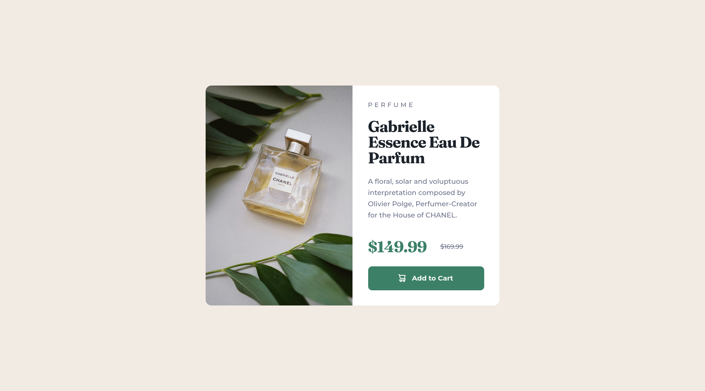

# Frontend Mentor - Product preview card component solution

This is a solution to the [Product preview card component challenge on Frontend Mentor](https://www.frontendmentor.io/challenges/product-preview-card-component-GO7UmttRfa). Frontend Mentor challenges help you improve your coding skills by building realistic projects. 

## Table of contents

- [Overview](#overview)
  - [The challenge](#the-challenge)
  - [Screenshots](#screenshots)
  - [Links](#links)
- [My process](#my-process)
  - [Built with](#built-with)
  - [What I learned](#what-i-learned)
  - [Useful resources](#useful-resources)
- [Author](#author)

## Overview

### The challenge

Users should be able to:

- View the optimal layout depending on their device's screen size
- See hover and focus states for interactive elements

### Screenshots

### Links

- Solution URL: [https://github.com/joshjavier/product-preview-card-component](https://github.com/joshjavier/product-preview-card-component)
- Live Site URL: [https://joshjavier.github.io/product-preview-card-component/](https://joshjavier.github.io/product-preview-card-component/)

## My process

### Built with

- Semantic HTML5 markup
- Flexbox
- Mobile-first workflow

### What I learned

I did this project to practice my frontend skills. Since I haven't worked on a frontend project for quite a while, I think I progressed slowly at the beginning as I'm thinking how to structure the workflow in my head. But once I remembered the pieces, it became easier to keep moving.

One thing I noticed is that it's okay - maybe even faster - to just code something shitty that *works*. I know that's something of a mantra in the programming community - "make it work, then make it better" - but a lot of times I want to make things better or pretty the first time, which tends to make progress slow. Something to keep in mind :)

In terms of the code, I learned about the `<picture>` element and used it to show different versions of an image for the mobile and desktop versions. Pretty cool "aha" moment right there. 💡

### Useful resources

- [\<picture\>: The Picture element](https://developer.mozilla.org/en-US/docs/Web/HTML/Element/picture)

## Author

- Website - [Josh Javier](https://joshjavier.com/)
- Frontend Mentor - [@joshjavier](https://www.frontendmentor.io/profile/joshjavier)
- Twitter - [@joshjavierr](https://twitter.com/joshjavierr)
- Codepen - [@joshjavier](https://codepen.io/joshjavier/)
- Codewars - [@joshjavier](https://www.codewars.com/users/joshjavier)
